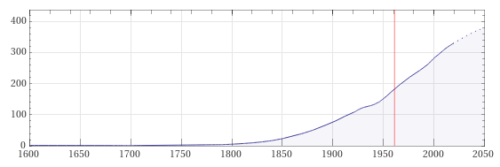

Continuation of the series
==========================

Smart numeric algorithm for continuation of the series.

Idea
----

Imagine a array of numbers that we obtain from monitoring historical data (for example, the development of the population in the city, inflation, exchange rates, ...).

Many series behave in a predictable way, which can be expressed by choosing an appropriate strategy (which this package defines or you can use yours), and accordingly we can calculate future values from history and current values with respect to time or another criterion.
